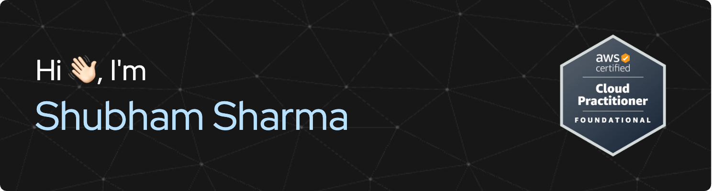

  
  

# About:
Hi, I’m **Shubham Sharma** — AWS Certified Cloud Practitioner and a Software Engineer building large-scale, fault-tolerant systems. I specialize in cloud-native development, distributed systems, and low-latency networking.

- 🚀 I’ve recently built a Kubernetes-powered Cloud IDE that reduced average file retrieval latency by 80% and ensured 99.99999999% uptime. 
- 🧠 I also engineered a DNS forwarder from scratch (RFC 1035 Compliant) with smart TTL aware caching and binary protocol parsing for high-speed information retrieval.  
- 🎓 I’m currently pursuing my MCA at MIT Manipal (top 3% of my batch, CGPA: 9.55) and am AWS Certfied Cloud Practitioner. 
- 💡 Always exploring the intersections of backend infrastructure, GenAI, and information retrieval systems. 

# Skills:

# Stats:

  

---

